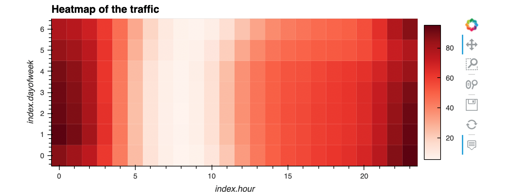
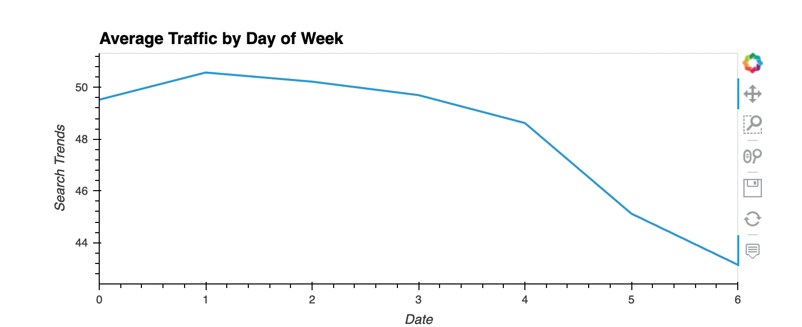
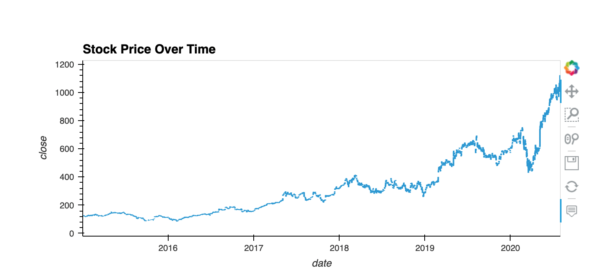
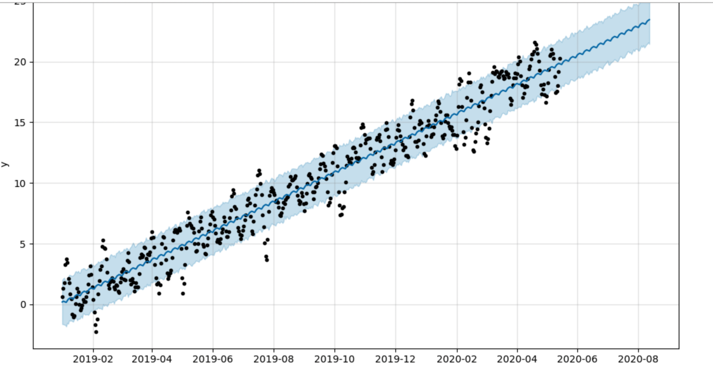

# Time_series_analysis-Prophet

This repository contains a Jupyter notebook analysis of time series data focusing on the correlation between a company's Google search traffic and its stock price. Our goal is to create a forecasting model using Prophet to predict hourly user search traffic and potentially forecast revenue, ultimately driving ROI and business strategy decisions.

### Table of Contents
- [Technologies](#technologies)
- [Installation](#installation)
- [Instructions](#instructions)
- [Contributors](#contributors)
- [License](#license)

### Technologies

This project leverages the following technologies:

* [Python 3.7.13](https://www.python.org/downloads/release/python-385/) - The programming language used in the project.
* [Pandas](https://pandas.pydata.org/) - A Python library used for efficient data manipulation.
* [Jupyter Lab](https://jupyter.org/) - An interactive development environment used to create and share documents containing live code, equations, visualizations, and narrative text.
* [PyVizlot](https://pyviz.org/) - A Python visualization package that provides a single platform for accessing multiple visualization libraries.
* [hvPlot 0.8.0](https://hvplot.holoviz.org/) - A plotting library used to create interactive line/bar graphs and scatter plots.
* [Prophet](https://facebook.github.io/prophet/): is a procedure for forecasting time series data based on an additive model.

### Installation

Before you can run the application, you will need to have Python installed on your machine. Python 3.8 or later is recommended.
Once Python and pip are ready, follow these steps:

1. Clone the repository to your local machine.
2. Install the necessary Python packages.
This project requires several Python libraries. You can install them using pip from your command line:
```
pip install pandas
pip install holoviews
pip install prophet
pip install hvplot
pip install numpy
```
3. Run the notebook.
* If you're using a Jupyter Notebook, navigate to the directory where the repository is cloned and type jupyter notebook in your command line. This will open the Jupyter interface in your browser. From there, you can select and open the notebook file **forecasting_net_prophet .ipynb**.
* If you're using Google Colab, you'll need to upload the notebook file to your Google Colab workspace and then open it.

### Instructions

The application involves a step-by-step approach to understand the correlations between search trends and financial metrics. We've outlined the main components of the project below:

1. Find Unusual Patterns in Hourly Google Search Traffic:
The first step involves analyzing the Google search traffic for unusual patterns. Our aim here is to establish a connection between these patterns and significant financial events. The "Heatmap of traffic" visual representation provides us an easy way to spot these unusual patterns, which might be correlated to key corporate financial events.



2. Search Traffic Data for Seasonality:
In this phase, we'll dig deeper into the search traffic data to uncover potential seasonal patterns. We will group the hourly search data and plot average traffic by the day of the week. The  "Traffic by day plot" gives us insights into when the highest traffic occurs, allowing us to uncover trends related to specific days or times.



3. Relate the Search Traffic to Stock Price Patterns:
Next, we'll attempt to find a relationship between search data and the company's stock price. This step involves combining the stock price data with the search data in a single DataFrame and analyzing it for common trends. The "Stock price over time" plot allows us to visually understand if the search traffic trends and stock price patterns follow similar paths.



4. Create a Time Series Model with Prophet:
Now, we'll build a Prophet forecasting model using the search data. Once the model is estimated, we'll be able to plot and examine the forecast. The forecasting plot provides us with insights about the expected future popularity of the company based on historical search data.

5. Forecast Revenue by Using Time Series Models:
The final step involves utilizing the Prophet model to predict the company's total sales for the next quarter. Our "Sales forecast" visual output gives us a projection of the expected total sales, including best-case and worst-case scenarios. This information can be crucial for the company's finance group to plan budgets and manage investor expectations.



## Contributors
Alexander Likhachev

## License
MIT


